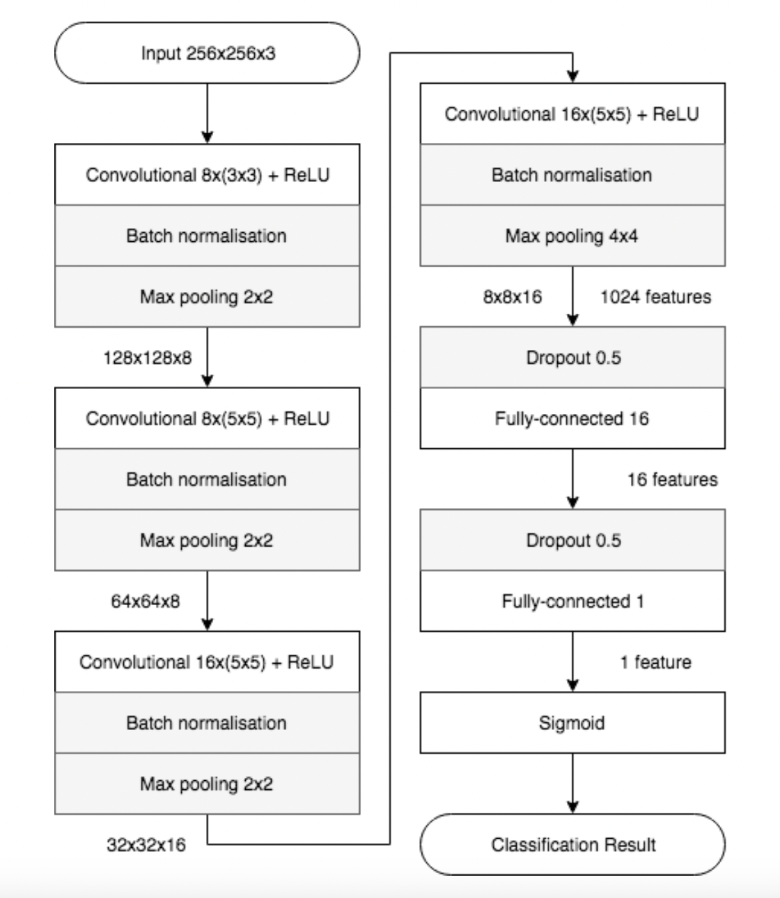
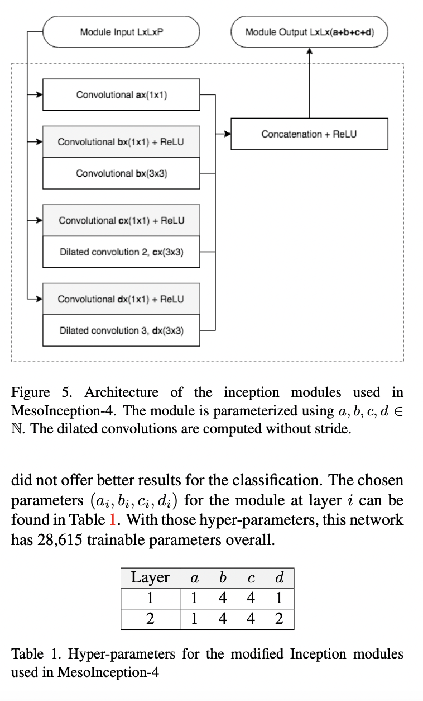

# DeepFakeDetection

!! Note that torchvision is not currently available on Python 3.13

## Naive detectors

### Mesonet
[Mesonet](https://arxiv.org/pdf/1809.00888) (2018) architecture for deepfake detection is discerning manipulated content. 
Mesonet is a compact facial video forgery detection network adressing *Deepfake* and *Face2Face*
These two problems cannot be solved with a unique network. But thanks to their similar nature, identical network structures for both problems can be used. The paper present a deep neural network with a small number of layers.

#### Meso-4

 

  

- 4 convulotional layers with one hidden layer
- ReLU activation
- Batch normalization to regularize the output and prevent the vanishing gradient effect
- Fully conntected layers use Droupout to regularize and improve their robustness
- 27,977 parameters to train

#### MesoInception-4
Alternative architecture:
- replace the first two convolution by a variant of the *inception module* (Szegedy et al).

Idea of the *Inception module*:

Stack the output of several convolutional layers with different kernel shapes and increase the function space in which the model is optimized.

 

  

